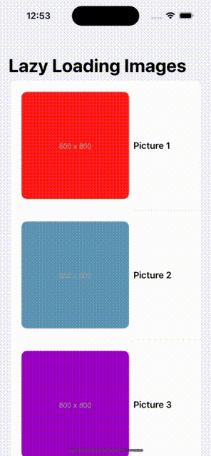

 
 
 

# SwiftUI_LazyImageLoad

SwiftUI Lazy Image Load is a project demonstrating an efficient and scalable way to load images lazily in SwiftUI. The solution ensures optimal performance by only loading images when they appear on the screen. This approach is particularly useful in scenarios involving lists, grids, or large data sets, helping to improve memory management and smooth scrolling experiences.

| Demo                                                                      |  Renderings                                                                                                        
| ------------------------------------------------------------------------  |  -----------------------------------------------------------------------------------------------------------  
| [SwiftUI_LazyImageLoad           ](SwiftUI_LazyImageLoad)           |       
